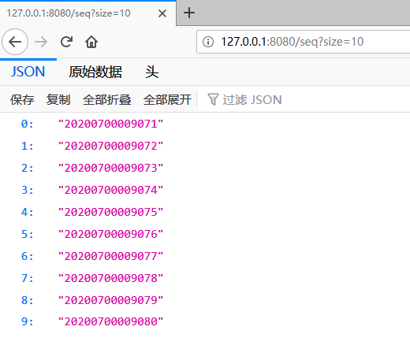

# JAVA 序号工具包 Sequence
[](https://app.codacy.com/gh/power4j/sequence?utm_source=github.com&utm_medium=referral&utm_content=power4j/sequence&utm_campaign=Badge_Grade_Dashboard)
[](https://codecov.io/gh/power4j/sequence)
[](https://travis-ci.org/github/power4j/sequence)
[](https://maven-badges.herokuapp.com/maven-central/com.power4j.kit/sequence)

使用场景

- 业务需要根据一定的规则生成序号，如：
  - 连续性：序号连续自增地进行分配
  - 相关性：多租户隔离、按年、月、日分区
  - 格式化: 序号输出的格式灵活可控
- 技术上需要满足
  - 高性能
  - 线程安全
  - 适用性好
  - 配置简单、容易集成

## 项目说明

- ***JDK 版本要求: `JDK8+`*** 

- 支持的后端
  - MySQL
  - PostgreSQL (`9.6 +`)
  - Redis
  - MongoDB


## 核心概念

- 号池([`SeqPool`](sequence-core/src/main/java/com/power4j/kit/seq/core/SeqPool.java)): 一种设施，可以提供有限或者无限的序号。
- 同步器([`SeqSynchronizer`](sequence-core/src/main/java/com/power4j/kit/seq/persistent/SeqSynchronizer.java)): 负责与某种后端(如数据库)交互,更新序号的当前值。
- 取号器([`SeqHolder`](sequence-core/src/main/java/com/power4j/kit/seq/persistent/SeqHolder.java)): 负责缓存从后端批量取出的序号，然后交给本地的号池来管理。
- 分区(`Partition`): 后端存储在保存序号信息时，序号的名称+分区表示一条唯一的记录,分区可以是静态的(一个字符串常量),也可以是动态分区(一个返回分区名称的函数)。分区并不是将序号的取值进行划分，主要是用于多租户等需要二次分类的场景以及避免号池耗尽。
- 格式化接口([`SeqFormatter`](sequence-core\src\main\java\com\power4j\kit\seq\core\SeqFormatter.java)): 自定义格式输出的扩展接口.

注意事项:
- 如果使用动态分区,不宜变化过于频繁，比如用系统时间作为分区。比较合适的是按年份、月份进行分区。
- 每一个分区的序号取值独立的，比如按年份进行分区，那么每年都有`Long.MAX`个序号可用。

## 使用方法


引入依赖
```xml
<dependency>
    <groupId>com.power4j.kit</groupId>
    <artifactId>sequence-spring-boot-starter</artifactId>
    <version>最新版本</version>
</dependency>
```

开启配置(JDBC)
```yaml
power4j:
  sequence:
    # 数据同步使用的后端支持(如: mysql,oracle,redis),跟你实际使用的数据源类型对应
    backend: mysql
```

也可以使用Redis，则配置方式为

```yaml
power4j:
  sequence:
    backend: redis
    lettuce-uri: "redis://127.0.0.1"
```

> `maven`依赖等详细配置请查看`examples`目录下的演示项目

使用

```java
@RestController
@SpringBootApplication
public class SequenceExampleApplication {
    @Autowired
    private Sequence<Long> sequence;
    public static void main(String[] args) {
        SpringApplication.run(SequenceExampleApplication.class, args);
    }

    @GetMapping("/seq")
    public List<String> getSequence(@RequestParam(required = false) Integer size) {
        size = (size == null || size <= 0) ? 10 : size;
        List<String> list = new ArrayList<>(size);
        for (int i = 0; i < size; ++i) {
            list.add(sequence.nextStr());
        }
        return list;
    }
}
```

## 性能测试


> 测试环境用的Redis,MySQL等外部服务都是默认安装，没有调整参数。
>
> 如果需要自己测试，已经为你写好测试脚本,见[run-bench.sh](bench-test/run-bench.sh)


## 效果演示

### 分配10个序号


### 数据库中的记录


### Redis中的记录


## 开发计划

 - [X] 支持MySQL(`1.0`)
 - [X] 支持PostgreSQL(`1.3`)
 - [ ] 支持H2(不一定会支持,因为缺乏应用场景)
 - [ ] 支持Oracle(不一定会支持,这货没有开源版本)
 - [x] 支持Redis(`1.1`)
 - [x] 支持MongoDB(`1.2`)
 - [X] Spring Boot 集成(`1.0`)
 - [ ] 优化多线程性能

 ## 贡献指南

 代码要求：
  - 统一风格，包含注释、代码缩进等与本项目保持一致
  - 保持代码整洁，比如注释掉的代码块等垃圾代码应该删除
  - 严格控制外部依赖，如果没有必要，请不要引入外部依赖
  - 请在类注释中保留你的作者信息，请不要害羞

 ### 数据库支持实现

 1. 参考[`MySqlSynchronizer`](sequence-core/src/main/java/com/power4j/kit/seq/persistent/provider/MySqlSynchronizer.java)的实现方式，实现某个特定数据库后端的支持
 2. 参考[`MySqlSynchronizerTest`](sequence-core/src/test/java/com/power4j/kit/seq/persistent/provider/MySqlSynchronizerTest.java) 编写单元测试，完成自测。如果你的代码能跑通测试，基本上应该没有严重bug

 ## 联系方式
 

 